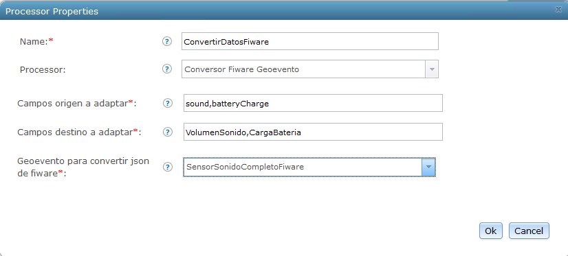
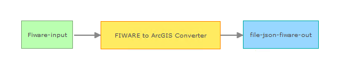

# FIWARE to ArcGIS Converter Processor
The FIWARE to ArcGIS Converter Processor reads a GeoEvent with FIWARE format that has been received from a Context Broker and transforms it to a new GeoEvent with a format easily readable by the ArcGIS Platform.

## Sections
*   Requirements
*	Building
*	Installation
*	Testing
*	Licensing

## Requirements

*	ArcGIS GeoEvent Extension for Server
*	ArcGIS Geoevent Extension for Server Software Development Kit (SDK) - the SDK is included with the Geoevent Extension installation
*	Java Development Kit (JDK) 1.6.x or 1.7.x
*	[Apache Maven](http://maven.apache.org/) (you may follow the GES SDK documentation to learn how to set up a Maven repository)

## Building
* Verify that Maven is installed and working correctly.
  * From a command prompt, type mvn -version and verify that it returns the version correctly.
  *	If the Maven version is not returned correctly, consult the GeoEvent Extension SDK Developer Guide for more information on how to set up Maven.
* Make any necessary changes to the pom.xml files to reflect the location of the GeoEvent Extension and GeoEvent Extension SDK repositories.
  *	If necessary, change the locations for the repository entries in the pom.xml.
  *	The current settings assume these will be located at:
    * /Program Files/ArcGIS/Server/GeoEventExtension/sdk/repository
    * /Program Files/ArcGIS/Server/GeoEventExtension/system
* Depending on the version of software you have installed, you may also need to change the version property in the pom.xml files.
* From a command prompt go to the ./fiware-adaptador-geoevento-processor directory.
* Type mvn install at the prompt and hit return.

## Installation
* Browse ./fiware-adaptador-geoevento-processor/target (this directory is created when you execute mvn install).
* Copy the .jar file from the target folder and paste it into the deploy directory on your GEP installation (ex. \deploy\ -- default location is C:\Program Files\ArcGIS\Server\GeoEventProcessor\deploy).

## Testing

In the following steps you will configure GeoEvent Processor to receive and process FIWARE data.
* Open GeoEvent Processor Manager.
* Create a new Input connector. 
  *	Go to 'Site' > 'GeoEvent' > 'Connectors'.
  *	Click 'Create Connector'.
  *	In the 'Creating New Connector' dialog configure the following parameters:	
    * Type: Input
    * Adapter: Generic-JSON
    * Transport: HTTP
    
* Create an input based on the previous connector to request FIWARE Context Broker.
  *	Open the file InputFiware.xml in a text editor.
  *	Edit the parameters:
    * clientPostBody: body of the request to Context Broker
    * headers: parameter list required by FIWARE. Format: name1:value1,name2:value2
    * clientURL: Context Broker URL
  *	Go to 'Site' > 'GeoEvent' > 'Configuration Store' and load the file InputFiware.xml.
  
* Create a new GeoEvent Definition.
  *	Go to 'Site' > 'GeoEvent' > 'Configuration Store'.
  *	Click 'Import Configuration' and select the file GeoEventConfig.xml.
  *	Go to 'Site' > 'GeoEvent' > 'GeoEvent Definitions' and select the 'GeoEvent Definition' SensorFiware.
    * For each FIWARE attribute you want to process, create a New Field and set a name and a type according to the data.
    
* Next, create an Output Connector to observe the received data.
  *	Navigate 'Services' > 'Outputs'.
  *	Select 'Add Output' and select 'Write to a json file' and configure the properties to save the files in a registered folder.
  
* Go to 'Services' > 'GeoEvent Services' and click 'Add Service'.
  *	In the 'Add New Service' dialog enter a name and description.
  *	On the left panel click and drag the input and the output services you created previously into the service constructor window.
  *	Next click and drag the 'FIWARE to ArcGIS Converter Processor' into the service constructor window.
  *	Configure the processor similar to the following:
    * Source fields to adapt: list of data field names received from the FIWARE Context Broker. 
    * Target fields to adapt: list of field names from GeoEvent Definition SensorFiware that will load the information of source fields. These fields has to be the equivalent of source fields and in the same order.
    * GeoEvent to convert json from Fiware: name of the GeoEvent Definition imported (SensorFiware).
 

  * Connect the components of the service as illustrated below:
 

 
* When finished click the 'Publish' button to save the service.
* In GeoEvent Processor Manager, navigate to ‘Services’ > ‘Monitor’ and observe the GeoEvent Processor components. You should see the newly created service and it should have a status of 'Started'.
* In GeoEvent Processor Manager, navigate to 'Services' > 'Monitor' to observe that the values are increasing and the selected outputs are updated.
* Next go to Services > Output and find the output service you created previosly
* Click the Stop button to stop the service
* In a file browser go to the folder where your output folder is located.
* Open the *.json file with the most recent timestamp.
* You can now test the processors with additional outputs such as published feature services.

