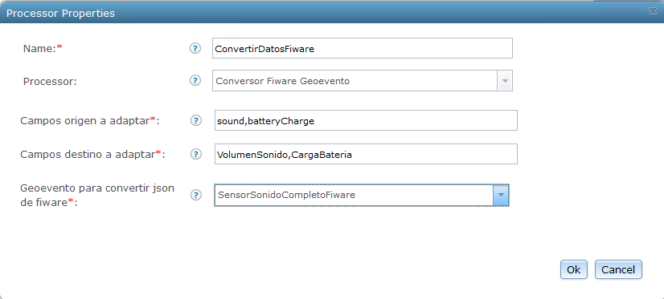
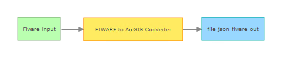

# FIWARE to ArcGIS Converter Processor
El Processor Conversor de FIWARE a ArcGIS lee un geoevento con formato de FIWARE que recibe del Context Broker y lo transforma en un nuevo geoevento con un formato fácil de gestionar directamente por la plataforma ArcGIS.

## Secciones
* Requisitos
*	Compilación
*	Instalación
*	Pruebas

## Requisitos

*	ArcGIS GeoEvent Extension for Server
*	ArcGIS Geoevent Extension for Server Software Development Kit (SDK) - el SDK se incluye con la instalación de la Extensión Geoevent
*	Java Development Kit (JDK) 1.6.x or 1.7.x
*	[Apache Maven](http://maven.apache.org/) (se puede seguir la documentación del SDK de GES para aprender cómo instalar un repositorio Maven)

## Compilación
* Verificar que Maven está instalado y funciona correctamente.
  * Desde una terminal de comandos, escribir `mvn -version` y verificar que devuelve la versión correctamente.
  *	Si la versión no se devuelve correctamente, consultar la Guía de Desarrollo del SDK de la extensión GeoEvent para obtener mas información acerca de cómo instalar Maven
* Hacer cualquier cambio necesario en el fichero pom.xml para reflejar la ruta de GeoEvent Extension y de GeoEvent Extension SDK.
  *	Las opciones actuales asumen que las rutas son las siguientes:
    * `/Program Files/ArcGIS/Server/GeoEventExtension/sdk/repository`
    * `/Program Files/ArcGIS/Server/GeoEventExtension/system`
* Dependiendo de la versión de Software que esté instalada, es posible que haya que cambiar la propiedad version en el fichero pom.xml.
* Desde una terminal de comandos, ir al directorio `./fiware-adaptador-geoevento-processor`.
* Ejecutar el comando `mvn install` en la terminal.

## Instalación
* Navegar a `./fiware-adaptador-geoevento-processor/target` (este directorio se ha creado al ejecutar `mvn install`).
* Copiar el fichero .jar desde la carpeta target y pegarlo en el directorio de despliegue en tu instalación de GEP, por ejemplo `\deploy\ -- default location is C:\Program Files\ArcGIS\Server\GeoEventProcessor\deploy`).

## Pruebas

En los pasos siguientes se configura GeoEvent Processor para recibir y procesar datos FIWARE.
* Abrir GeoEvent Processor Manager.
* Crear un nuevo conector de tipo Input. 
  *	Ir a 'Site' > 'GeoEvent' > 'Connectors'.
  *	Hacer clic en 'Create Connector'.
  *	En el diálogo 'Creating New Connector' configurar los siguientes parámetros:	
    * Type: Input
    * Adapter: Generic-JSON
    * Transport: HTTP
    
* Crear un input basado en el conector que se ha crado previamente para hacer las peticiones al Context Broker de FIWARE.
  *	Abrir el fichero InputFiware.xml en un editor de texto.
  *	Editar los parámetros:
    * clientPostBody: cuerpo de la petición al Context Broker
    * headers: lista de parámetros requeridos por con formato: nombre1:valor1,nombre2:valor2
    * clientURL: URL del Context Broker
  *	Ir a 'Site' > 'GeoEvent' > 'Configuration Store' y cargar el fichero InputFiware.xml.
  
* Crear una nueva definición de geoevento (GeoEvent Definition).
  *	Ir a 'Site' > 'GeoEvent' > 'Configuration Store'.
  *	Hacer clic en 'Import Configuration' y seleccionar el fichero GeoEventConfig.xml.
  *	Ir a 'Site' > 'GeoEvent' > 'GeoEvent Definitions' y seleccionar la definición de geoevento SensorFiware.
    * Por cada atributo FIWARE  que se quiera procesar, crear un campo nuevo haciendo clic en 'New Field' y establecer un nombre y un tipo de acuerdo a los datos.
    
* A continuación, crear un conector de tipo Output para observar los datos recibidos y comprobar que son correctos.
  *	Navegar a 'Services' > 'Outputs'.
  *	Seleccionar 'Add Output', 'Write to a json file' y configurar las propiedades para salvar los ficheros en una carpeta registrada.
  
* Ir a 'Services' > 'GeoEvent Services' y hacer clic en 'Add Service'.
  *	En el diálogo 'Add New Service' introducir un nombre y una descripción.
  *	En el panel izquierdo hacer clic y arrastrar los servicios de entrada y salida que se han creado previamente a la ventana de construcción del servicio.
  *	A continuación hacer clic y arrastrar el procsador 'Conversor FIWARE GeoEevnto' a la ventana de construcción del servicio.
  *	Configurar el procesador como se describe a continuación:
    * Campos origen a adaptar: lista de todos los nombres de campos no obligatorios del geoevento recibido del Context Broker de FIWARE. 
    * Campos destino a adaptar: lista de todos los nombres de campos de la definición de geoevento SensorFiware en los que se almacenará la información de los campos origen. Estos campos deben ser los equivalentes a los campos origen y estar en el mismo orden.
    * Geoevento para convertir json de fiware: nombre del GeoEvent Definition importado (SensorFiware).
 

  * Conectar los componentes del servicio como se ilustra abajo:
 

 
* Cuando se termine de conectar, hacer clic en el botón 'Publish' para salvar el servicio.
* En GeoEvent Processor Manager, navegar a 'Services' > 'Monitor' y observar los componentes del GeoEvent Processor. Se debería ver el servicio recién creado y debería tener estado iniciado.
* En GeoEvent Processor Manager, navegar a 'Services' > 'Monitor' y observar que los valores están incrementándose y que las salidas seleccionas se están actualizando.
* Ir a 'Services' > 'Output' y buscar el servicio de salida que se creó previamente.
* Hacer clic en el botón 'Stop' para parar el servicio.
* En un explorador de ficheros ir a la carpeta en la que se ubica la carpeta de salida.
* Abrir el fichero *.json con el timestamp más reciente.

* Si todo funciona correctamente, ahora se pueden hacer pruebas con salidas o análisis adicionales, como publicar la salida en un Feature Service.
